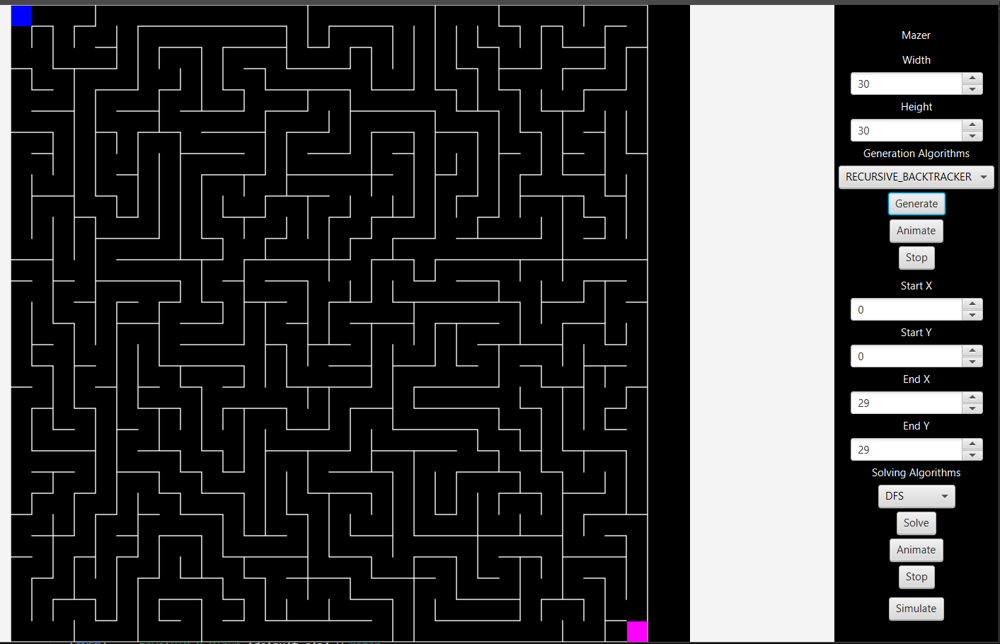
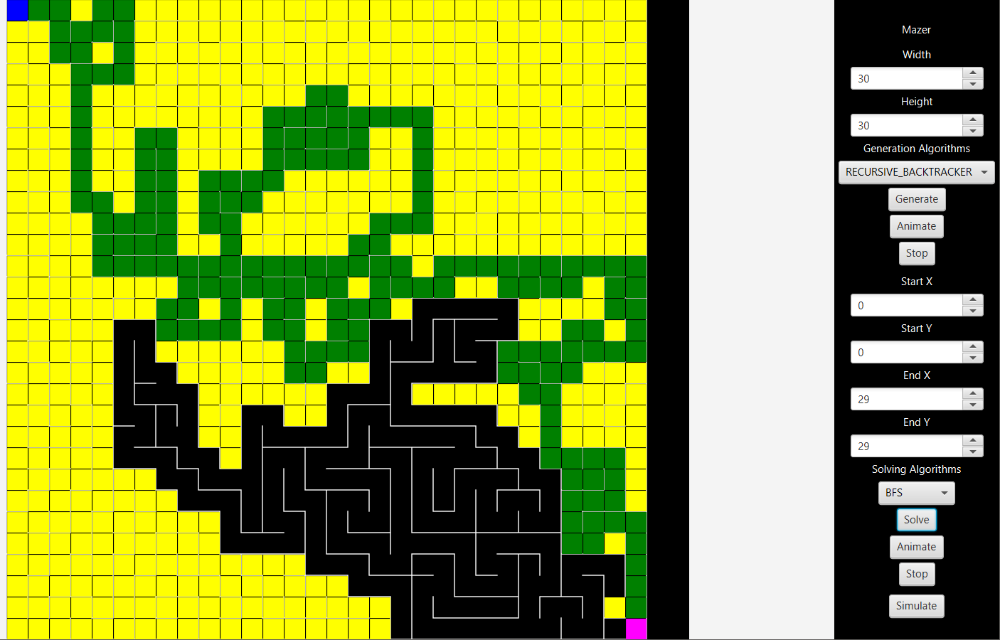
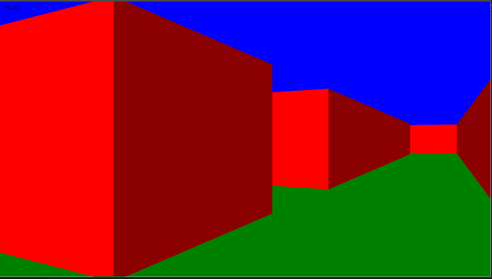
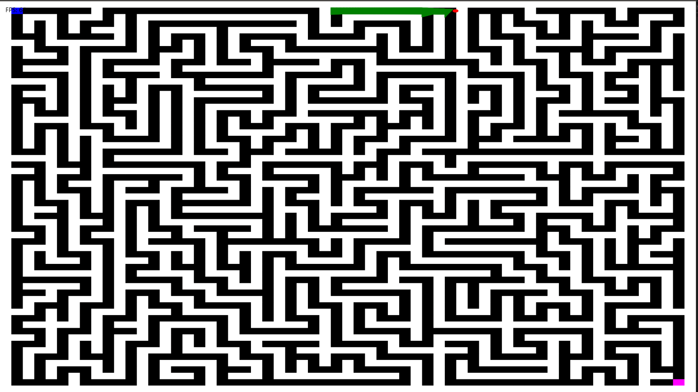

# MazerApp

MazerApp is a JavaFX-based interactive maze generator and solver. It allows users to generate mazes with multiple algorithms, solve them with different strategies, and visualize both the solving process and a real-time traversal using a raycaster. The app provides both 2D and 3D views with dynamic visual feedback.

---

## Features

### Maze Generation
- **11 algorithms** supported:
  - **Recursive Backtracker** – Depth-first search based maze generation.
  - **Kruskal** – Minimum spanning tree approach to create perfect mazes.
  - **Prim** – Similar to Kruskal, but adds walls incrementally.
  - **Aldous-Broder** – Random walk algorithm producing uniform mazes.
  - **Wilson** – Loop-erased random walk for unbiased mazes.
  - **Recursive Divider** – Maze created by recursively splitting regions.
  - **Growing Tree** – Flexible algorithm combining DFS and BFS behavior.
  - **Eller** – Row-based algorithm for generating mazes efficiently.
  - **Binary Tree** – Simple algorithm carving passages in two directions.
  - **Sidewinder** – Creates mazes with horizontal bias and open vertical paths.

- **Visualization modes:**
  - **Live Animation** – Watch the maze being generated step by step.
  - **Instant Generation** – Generate the entire maze immediately.

### Maze Solving
- **5 algorithms** supported:
  - **DFS (Depth-First Search)** – Explores as deep as possible before backtracking.
  - **BFS (Breadth-First Search)** – Finds the shortest path using a queue.
  - **A\*** – Heuristic-driven pathfinding for efficient solutions.
  - **Best-First Search** – Chooses next cell based on closeness to the goal.
  - **Trémaux's Algorithm** – Marks visited paths and backtracks intelligently.

- **Visualization modes:**
  - **Animated** – Watch the solver explore the maze in real-time.
  - **Instant** – Solve and display the solution immediately.
  
- **Additional features:**
  - **Current cell tracking** – Highlight the current cell being processed.
  - **Visited path visualization** – See which cells were visited during solving.
  - **User-selected start & end points** – Customize start and goal positions.

### Raycaster Simulation
- **Real-time maze traversal** with a 3D first-person perspective. (press ESC key to exit simulation mode)
- **2D map view** showing ray emitter visualization.
- **Toggle** between 3D and 2D views dynamically using TAB key

---

## Screenshots









---

## Requirements

- Java 11 or higher
- JavaFX 21+  
- Maven (for building from source)

---

## Building & Running

1. Clone the repository:
   ```bash
   git clone https://github.com/bakr2023.2024/mazer.git
   cd mazer
   mvn clean javafx:run
   ```